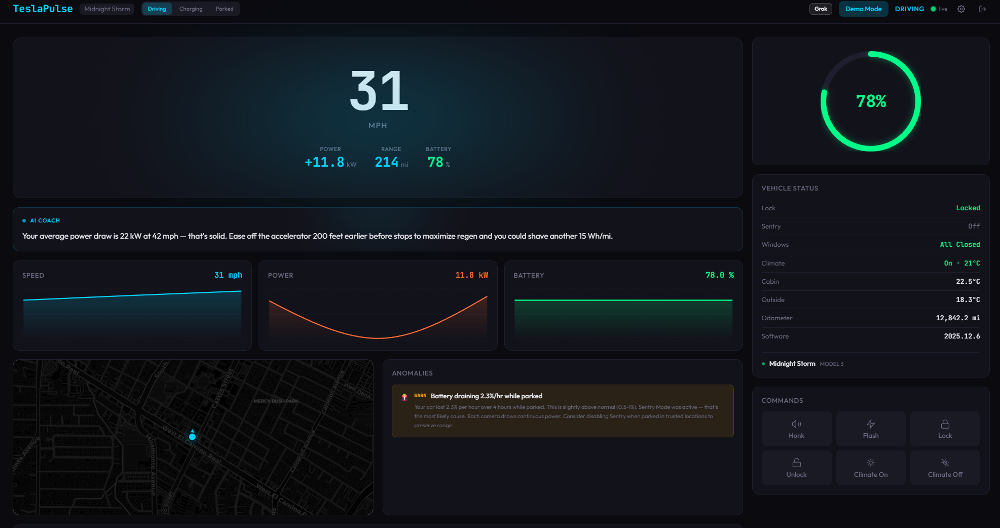

# TeslaPulse ⚡

AI-powered real-time telemetry dashboard for Tesla vehicles. Streams live vehicle data via the Tesla Fleet API and uses AI to provide driving efficiency coaching, trip summaries, anomaly detection, and a conversational chat interface.

Supports **Grok**, **Claude**, **GPT**, and **Gemini** — pick your AI co-pilot.



## Features

- **Real-time telemetry** — Speed, power, battery, range, climate, location on a cinematic HUD
- **AI Driving Coach** — Live efficiency tips every 60 seconds while driving
- **Trip Summaries** — AI-generated post-drive analysis with efficiency score, highlights, and tips
- **Anomaly Detection** — Catches vampire drain, power spikes, tire pressure imbalance, temp outliers
- **AI Chat** — Ask questions about your car's data in natural language
- **Voice Co-Pilot** — Talk to your car's AI using Grok's Voice Agent API (real-time, hands-free)
- **Background Polling** — Records telemetry 24/7 even when the dashboard isn't open
- **Persistent History** — Trips and telemetry stored in SQLite, survive restarts
- **PWA Support** — Install on your phone as a native-feeling app
- **Multi-LLM** — Choose between Grok, Claude, GPT, or Gemini
- **Settings UI** — Configure everything from the browser, no env files needed
- **Auth** — Password-protected with JWT sessions
- **Demo Mode** — Full dashboard with simulated data, no Tesla or API keys required

## Quick Start (Demo Mode)

No API keys needed — just run it:

```bash
git clone https://github.com/YOUR_USERNAME/tesla-pulse.git
cd tesla-pulse
npm install
npm run dev
```

Open http://localhost:3000. Set a password on first launch. Demo mode is on by default with simulated driving, charging, and parked scenarios.

## Full Setup (Live Data)

### 1. Tesla Fleet API

1. Go to [developer.tesla.com](https://developer.tesla.com) and create a Fleet API application
2. Configure:
   - **Allowed Origin:** `http://localhost:3000`
   - **Allowed Redirect URI:** `http://localhost:3000/auth/callback`
   - **Scopes:** Vehicle Information, Vehicle Location, Vehicle Commands, Vehicle Charging Management
3. Copy your Client ID and Client Secret

### 2. LLM API Key (pick one)

| Provider | Get API Key | Models | Est. Cost |
|----------|------------|--------|-----------|
| **Grok** (default) | [console.x.ai](https://console.x.ai) | grok-4-fast / grok-4 | ~$0.50/mo |
| Claude | [console.anthropic.com](https://console.anthropic.com) | claude-sonnet-4.6 | ~$6/mo |
| GPT | [platform.openai.com](https://platform.openai.com) | gpt-5.4 | ~$5/mo |
| Gemini | [aistudio.google.com](https://aistudio.google.com) | gemini-3.1-flash-lite / pro | ~$4/mo |

### 3. Configure

**Option A — Settings page (recommended):**
1. Run `npm run dev` and open http://localhost:3000/settings
2. Turn off Demo Mode
3. Enter your Tesla Client ID + Secret
4. Select your LLM provider and enter the API key
5. Save

**Option B — Environment file:**
```bash
cp .env.local.example .env.local
# Edit .env.local with your keys
```

### 4. Connect Your Tesla

1. Visit http://localhost:3000/api/tesla/auth
2. Log in with your Tesla account and approve permissions
3. Dashboard shows live vehicle data

## Production Deployment

Deploy to any VPS (DigitalOcean, AWS, Hetzner, etc.):

```bash
npm run build

# Transfer .next/, public/, package.json, package-lock.json, next.config.ts to your server
# Run: npm install --production && npx next start -p 3100

# See scripts/ for:
#   deploy.sh              — automated build + deploy script
#   nginx-teslapulse.conf  — nginx reverse proxy config
#   teslapulse.service     — systemd service file
```

**Note:** Tesla blocks OAuth token exchange from datacenter IPs. Authenticate locally and use the **Token Sync** feature in Settings to push tokens to your server. The refresh token lasts 3 months.

## Mobile App (PWA)

1. Deploy TeslaPulse to a server with HTTPS
2. Open the URL on your phone
3. Tap "Add to Home Screen" (iOS) or "Install" (Android)
4. Launches as a fullscreen app with the TeslaPulse icon

## Voice Co-Pilot

TeslaPulse includes a voice interface powered by xAI's Grok Voice Agent API. Tap the mic button on the dashboard to talk to "Pulse" — your AI co-pilot that has access to real-time vehicle telemetry.

- Requires **Grok** as the LLM provider (uses the xAI Realtime API)
- 5 voice options: Rex, Leo, Eve, Ara, Sal — configurable in Settings
- Hands-free mode keeps the mic always open
- Server-side WebSocket proxy keeps your API key secure
- Live telemetry injected into the AI's context every 30 seconds

**Production setup:** Add a WebSocket proxy to your nginx config for `/voice` → `localhost:3101`. See `scripts/nginx.conf.example`.

## Tesla API Costs

Tesla provides a **$10/month free credit** per developer account. TeslaPulse is designed to stay within this:

- 15s polling during driving, 60s background, 5min parked
- Never wakes a sleeping car during background polling
- Estimated cost: **$0–2/month** for typical personal use

## Tech Stack

- **Frontend:** Next.js 15, TypeScript, Tailwind CSS, Recharts, Framer Motion, Leaflet
- **Backend:** Next.js API routes, SQLite (better-sqlite3)
- **AI:** Grok / Claude / GPT / Gemini (provider-agnostic abstraction)
- **Auth:** bcrypt + JWT, HTTP-only cookies
- **Tesla:** Fleet API with OAuth 2.0 + offline_access

## Project Structure

```
src/
├── app/                    # Next.js App Router pages + API routes
│   ├── page.tsx            # Main dashboard
│   ├── login/              # Auth page
│   ├── settings/           # Settings page
│   └── api/
│       ├── ai/             # Coach, trip summary, chat endpoints
│       ├── auth/           # Login, logout, setup, password change
│       ├── settings/       # Settings CRUD + provider info
│       ├── tesla/          # Vehicle data, commands, auth, token sync
│       └── trips/          # Trip history
├── components/             # React components
│   ├── Dashboard.tsx       # Main dashboard layout
│   ├── HeroMetric.tsx      # Big speed/battery display
│   ├── TelemetryChart.tsx  # Real-time sparkline charts
│   ├── BatteryGauge.tsx    # Animated ring gauge
│   ├── MiniMap.tsx         # Leaflet location map
│   ├── AICoachCard.tsx     # AI efficiency tip card
│   ├── ChatPanel.tsx       # Collapsible AI chat
│   ├── VoiceCoPilot.tsx    # Voice co-pilot with mic + audio playback
│   ├── TripHistory.tsx     # Past trips with AI summaries
│   └── ...
├── hooks/                  # Custom React hooks
├── lib/                    # Server-side utilities
│   ├── llm/                # Multi-provider LLM abstraction
│   ├── settings.ts         # Settings management
│   ├── tesla-api.ts        # Tesla Fleet API client
│   ├── tesla-auth.ts       # OAuth flow + token refresh
│   ├── db.ts               # SQLite schema + queries
│   ├── background-poller.ts # Server-side telemetry recording
│   ├── voice-server.ts     # WebSocket proxy for voice co-pilot
│   └── voice-prompt.ts     # Dynamic voice system prompt builder
└── types/                  # TypeScript type definitions
```

## Contributing

Pull requests welcome! If you build something cool on top of TeslaPulse, let me know.

## License

MIT License — see [LICENSE](LICENSE)
